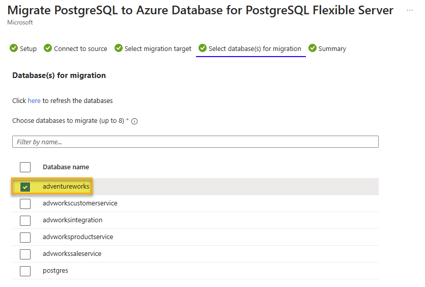

---
lab:
  title: Migración de base de datos de PostgreSQL sin conexión
  module: Migrate to Azure Database for PostgreSQL Flexible Server
---

# Migración de base de datos de PostgreSQL sin conexión

En este ejercicio, crearás un servidor flexible de Azure Database for PostgreSQL y realizarás una migración de base de datos sin conexión desde un servidor de PostgreSQL local o un servidor de Azure Database for PostgreSQL mediante la característica Migración en el servidor flexible de Azure Database for PostgreSQL.

## Antes de comenzar

Debe tener una suscripción a Azure propia para completar este ejercicio. Si no tiene una suscripción a Azure, puede obtener una [evaluación gratuita de Azure](https://azure.microsoft.com/free).

### Edita el archivo pg_hba.conf para permitir la conectividad desde Azure (omitir si no se migra desde un servidor PostgreSQL externo)

> [!NOTE]
> Este laboratorio crea dos instancias de Azure Database for PostgreSQL para usarlas como origen y destino para la migración. Sin embargo, si usas tu propio entorno, para completar este ejercicio, necesitarás acceso a un servidor PostgreSQL existente con una base de datos, permisos adecuados y acceso a la red.
> 
> Si usas tu propio entorno, este ejercicio requerirá que el servidor que uses como origen para la migración sea accesible para el servidor flexible de Azure Database for PostgreSQL para que pueda conectarse y migrar bases de datos. Esto requerirá que el servidor de origen sea accesible a través de una dirección IP pública y un puerto. Se puede descargar una lista de direcciones IP de región de Azure desde [Intervalos IP y etiquetas de servicio de Azure: nube pública](https://www.microsoft.com/en-gb/download/details.aspx?id=56519) para ayudar a minimizar los intervalos permitidos de direcciones IP en tus reglas de firewall basadas en la región de Azure usada. Abre el firewall de tus servidores para permitir que la característica de migración del servidor de flexible de Azure Database for PostgreSQL acceda al servidor PostgreSQL de origen que, de manera predeterminada, es el puerto TCP **5432**.
>
> Cuando se usa un dispositivo de firewall frente a la base de datos de origen, puede que tengas que agregar reglas de firewall para permitir que la característica de migración del servidor flexible de Azure Database for PostgreSQL acceda a las bases de datos de origen para realizar la migración.
>
> La versión máxima admitida de PostgreSQL para la migración es la versión 16.

El servidor PostgreSQL de origen deberá tener actualizado el archivo pg_hba.conf para asegurarse de que la instancia permitirá la conectividad desde el servidor flexible de Azure Database for PostgreSQL.

1. Agregarás entradas a pg_hba.conf para permitir conexiones desde los intervalos IP de Azure. Las entradas de pg_hba.conf dictan qué hosts pueden conectarse, qué bases de datos, qué usuarios y qué métodos de autenticación se pueden usar.
1. Por ejemplo, si tus servicios de Azure están dentro del intervalo IP 104.45.0.0/16. Para permitir que todos los usuarios se conecten a todas las bases de datos de este intervalo mediante la autenticación de contraseña, agregarías lo siguiente:

``` bash
host    all    all    104.45.0.0/16    md5
```

1. Al permitir conexiones a través de Internet, incluidas las de Azure, asegúrate de que tienes mecanismos de autenticación seguros implementados

- Use contraseñas seguras.
- Restringe el acceso a tan pocas direcciones IP como sea práctico.
- Usa una VPN o VNet: si es posible, configura una red privada virtual (VPN) o una red virtual (VNet) de Azure para proporcionar un túnel seguro entre Azure y tu servidor PostgreSQL.

1. Después de guardar los cambios en pg_hba.conf, debes volver a cargar la configuración de PostgreSQL para que los cambios surtan efecto mediante un comando SQL dentro de una sesión de psql:

```sql
SELECT pg_reload_conf();
```

1. Prueba la conexión de Azure a tu servidor de PostgreSQL local para asegurarte de que la configuración funciona según lo previsto. Puedes hacerlo desde una VM de Azure o un servicio que admita conexione de base de datos salientes.

### Implementación de recursos en tu suscripción a Azure

Este paso te guía por el uso de comandos de la CLI de Azure desde Azure Cloud Shell para crear un grupo de recursos y ejecutar un script de Bicep para implementar los servicios de Azure necesarios para completar este ejercicio en tu suscripción a Azure.

1. Abra un explorador web y vaya a [Azure Portal](https://portal.azure.com/).

1. Selecciona el icono de **Cloud Shell** en la barra de herramientas de Azure Portal para abrir un nuevo panel de [Cloud Shell](https://learn.microsoft.com/azure/cloud-shell/overview) en la parte inferior de la ventana del explorador.

    

    Si se te solicita, selecciona las opciones necesarias para abrir un shell de *Bash*. Si anteriormente has usado una consola de *PowerShell*, cámbiala a un shell de *Bash*.

1. En el símbolo del sistema de Cloud Shell, escribe lo siguiente para clonar el repositorio de GitHub que contiene recursos del ejercicio:

    ```bash
    git clone https://github.com/MicrosoftLearning/mslearn-postgresql.git
    ```

1. A continuación, ejecutarás tres comandos para definir variables para reducir la escritura redundante al usar comandos de la CLI de Azure para crear recursos de Azure. Las variables representan el nombre que se va a asignar a tu grupo de recursos (`RG_NAME`), la región de Azure (`REGION`) en la que se implementarán los recursos y una contraseña generada aleatoriamente para el inicio de sesión de administrador de PostgreSQL (`ADMIN_PASSWORD`).

    En el primer comando, la región asignada a la variable correspondiente es `eastus`, pero también puedes reemplazarla por una ubicación de tu preferencia.

    ```bash
    REGION=eastus
    ```

    El siguiente comando asigna el nombre que se usará para el grupo de recursos que hospedará todos los recursos usados en este ejercicio. El nombre del grupo de recursos asignado a la variable correspondiente es `rg-learn-work-with-postgresql-$REGION`, donde `$REGION` es la ubicación que especificaste anteriormente. Sin embargo, puedes cambiarlo a cualquier otro nombre de grupo de recursos que se adapte a tu preferencia.

    ```bash
    RG_NAME=rg-learn-work-with-postgresql-$REGION
    ```

    El comando final genera aleatoriamente una contraseña para el inicio de sesión de administrador de PostgreSQL. Asegúrate de copiarlo en un lugar seguro para poder usarlo más adelante para conectarte al servidor flexible de PostgreSQL.

    ```bash
    a=()
    for i in {a..z} {A..Z} {0..9}; 
       do
       a[$RANDOM]=$i
    done
    ADMIN_PASSWORD=$(IFS=; echo "${a[*]::18}")
    echo "Your randomly generated PostgreSQL admin user's password is:"
    echo $ADMIN_PASSWORD
    ```

1. Si tienes acceso a más de una suscripción a Azure y tu suscripción predeterminada no es aquella en la que quieres crear el grupo de recursos y otros recursos para este ejercicio, ejecuta este comando para establecer la suscripción adecuada. Para ello, reemplaza el token `<subscriptionName|subscriptionId>` por el nombre o el identificador de la suscripción que quieres usar:

    ```azurecli
    az account set --subscription <subscriptionName|subscriptionId>
    ```

1. Ejecuta el siguiente comando de la CLI de Azure para crear tu grupo de recursos:

    ```azurecli
    az group create --name $RG_NAME --location $REGION
    ```

1. Por último, usa la CLI de Azure para ejecutar un script de implementación de Bicep para aprovisionar recursos de Azure en tu grupo de recursos:

    ```azurecli
    az deployment group create --resource-group $RG_NAME --template-file "mslearn-postgresql/Allfiles/Labs/Shared/deploy-postgresql-server-migration.bicep" --parameters adminLogin=pgAdmin adminLoginPassword=$ADMIN_PASSWORD databaseName=adventureworks
    ```

    El script de implementación de Bicep aprovisiona los servicios de Azure necesarios para completar este ejercicio en tu grupo de recursos. Los recursos implementados son dos servidores flexibles de Azure Database for PostgreSQL. Un servidor de origen y uno de destino para la migración.

    La implementación suele tardar varios minutos en completarse (de 5 a 10 minutos). Puedes supervisarla desde Cloud Shell o ir a la página **Implementaciones** del grupo de recursos que creaste anteriormente y observar allí el progreso de la implementación.

1. Cierra el panel de Cloud Shell una vez completada la implementación de recursos.

1. En Azure Portal, revisa los nombres de los dos nuevos servidores de Azure Database for PostgreSQL. Ten en cuenta que, al enumerar las bases de datos del servidor de origen, incluye la base de datos **adventureworks**, pero la de destino no.

1. En la sección **Redes** de *ambos* servidores,
    1. Selecciona **+ Agregar dirección IP actual (xxx.xxx.xxx)** y **Guardar**.
    1. Seleccione la casilla **Permitir acceso público a este servidor desde cualquier servicio de Azure dentro de Azure**.
    1. Seleccione la casilla **Permitir el acceso público a este recurso a través de Internet mediante una dirección IP pública**.

> [!NOTE]
> En un entorno de producción, solo tendrías que seleccionar esas opciones, redes y direcciones IP que quieras que tengan acceso a tus servidores de Azure Database for PostgreSQL. 

> [!NOTE]
> Como se indicó anteriormente, este script de Bicep creará dos servidores de Azure Database for PostgreSQL, uno de origen y uno de destino.  ***Si usas un servidor de PostgreSQL local en tu entorno como servidor de origen para este laboratorio, reemplaza la información de conexión del servidor de origen en todas las instrucciones siguientes con la información de conexión del servidor local en tu entorno***.  Asegúrate de habilitar las reglas de firewall necesarias en tu entorno y en Azure.
    
### Solución de errores de implementación

Es posible que encuentres algunos errores al ejecutar el script de implementación de Bicep. Los mensajes más comunes y los pasos para resolverlos son:

- Si anteriormente ejecutaste el script de implementación de Bicep para esta ruta de aprendizaje y, posteriormente, eliminaste los recursos, puedes recibir un mensaje de error similar al siguiente si intentas volver a ejecutar el script en un plazo de 48 horas después de eliminar los recursos:

    ```bash
    {"code": "InvalidTemplateDeployment", "message": "The template deployment 'deploy' is not valid according to the validation procedure. The tracking id is '4e87a33d-a0ac-4aec-88d8-177b04c1d752'. See inner errors for details."}
    
    Inner Errors:
    {"code": "FlagMustBeSetForRestore", "message": "An existing resource with ID '/subscriptions/{subscriptionId}/resourceGroups/rg-learn-postgresql-ai-eastus/providers/Microsoft.CognitiveServices/accounts/{accountName}' has been soft-deleted. To restore the resource, you must specify 'restore' to be 'true' in the property. If you don't want to restore existing resource, please purge it first."}
    ```

    Si recibes este mensaje, modifica el comando `azure deployment group create` anterior para establecer el parámetro `restore` igual a `true` y vuelve a ejecutarlo.

- Si la región seleccionada está restringida al aprovisionamiento de recursos específicos, debes establecer la variable `REGION` en otra ubicación y volver a ejecutar los comandos para crear el grupo de recursos y ejecutar el script de implementación de Bicep.

    ```bash
    {"status":"Failed","error":{"code":"DeploymentFailed","target":"/subscriptions/{subscriptionId}/resourceGroups/{resourceGrouName}/providers/Microsoft.Resources/deployments/{deploymentName}","message":"At least one resource deployment operation failed. Please list deployment operations for details. Please see https://aka.ms/arm-deployment-operations for usage details.","details":[{"code":"ResourceDeploymentFailure","target":"/subscriptions/{subscriptionId}/resourceGroups/{resourceGrouName}/providers/Microsoft.DBforPostgreSQL/flexibleServers/{serverName}","message":"The resource write operation failed to complete successfully, because it reached terminal provisioning state 'Failed'.","details":[{"code":"RegionIsOfferRestricted","message":"Subscriptions are restricted from provisioning in this region. Please choose a different region. For exceptions to this rule please open a support request with Issue type of 'Service and subscription limits'. See https://review.learn.microsoft.com/en-us/azure/postgresql/flexible-server/how-to-request-quota-increase for more details."}]}]}}
    ```

- Si el script no puede crear un recurso de IA debido al requisito de aceptar el contrato de IA responsable, puedes experimentar el siguiente error; en cuyo caso, usa la interfaz de usuario de Azure Portal para crear un recurso de Servicios de Azure AI y, a continuación, vuelve a ejecutar el script de implementación.

    ```bash
    {"code": "InvalidTemplateDeployment", "message": "The template deployment 'deploy' is not valid according to the validation procedure. The tracking id is 'f8412edb-6386-4192-a22f-43557a51ea5f'. See inner errors for details."}
     
    Inner Errors:
    {"code": "ResourceKindRequireAcceptTerms", "message": "This subscription cannot create TextAnalytics until you agree to Responsible AI terms for this resource. You can agree to Responsible AI terms by creating a resource through the Azure Portal then trying again. For more detail go to https://go.microsoft.com/fwlink/?linkid=2164190"}
    ```

## Creación de una base de datos, tabla y datos para migración

Este laboratorio ofrece la opción de migrar desde un servidor de PostreSQL local o desde un servidor de Azure Database for PostgreSQL. Sigue las instrucciones para el tipo de servidor desde el que vas a migrar.

### Creación de una base de datos en el servidor de PostgreSQL local (omitir si se migra desde un servidor de Azure Database for PostgreSQL)

Ahora, es necesario configurar la base de datos, que migrarás al servidor flexible de Azure Database for PostgreSQL. Este paso debe completarse en tu instancia del servidor PostgreSQL de origen, que deberá ser accesible para el servidor flexible de Azure Database for PostgreSQL para completar este laboratorio.

En primer lugar, necesitamos crear una base de datos vacía, en la que crearemos una tabla y, a continuación, la cargaremos con datos. En primer lugar, deberás descargar los archivos ***Lab10_setupTable.sql*** y ***Lab10_workorder.csv*** del [repositorio](https://github.com/MicrosoftLearning/mslearn-postgresql/tree/main/Allfiles/Labs/10) a tu unidad local (por ejemplo, **C:\\**).
Una vez que tengas estos archivos, podemos crear la base de datos con el comando siguiente, **reemplazar los valores de host, puerto y nombre de usuario según sea necesario para el servidor PostgreSQL.**

```bash
psql --host=localhost --port=5432 --username=pgadmin --command="CREATE DATABASE adventureworks;"
```

Ejecuta el siguiente comando para crear la tabla `production.workorder` para cargar los datos:

```sql
    DROP SCHEMA IF EXISTS production CASCADE;
    CREATE SCHEMA production;
    
    DROP TABLE IF EXISTS production.workorder;
    CREATE TABLE production.workorder
    (
        workorderid integer NOT NULL,
        productid integer NOT NULL,
        orderqty integer NOT NULL,
        scrappedqty smallint NOT NULL,
        startdate timestamp without time zone NOT NULL,
        enddate timestamp without time zone,
        duedate timestamp without time zone NOT NULL,
        scrapreasonid smallint,
        modifieddate timestamp without time zone NOT NULL DEFAULT now()
    )
    WITH (
        OIDS = FALSE
    )
    TABLESPACE pg_default;
    ALTER TABLE production.workorder OWNER to pgAdmin;
```

```sql
psql --host=localhost --port=5432 --username=postgres --dbname=adventureworks --command="\COPY production.workorder FROM 'C:\Lab10_workorder.csv' CSV HEADER"
```

La salida del comando debe ser `COPY 72101`, que indica que se escribieron 72101 filas en la tabla desde el archivo CSV.

## Migración previa (omitir si se migra desde un servidor de Azure Database for PostgreSQL)

Antes de iniciar la migración sin conexión de la base de datos desde el servidor de origen, es necesario asegurarse de que el servidor de destino está configurado y listo.

1. Migra usuarios y roles del servidor de origen al nuevo servidor flexible. Esto se puede lograr mediante la herramienta pg_dumpall con el código siguiente.
    1. Los roles de superusuario no se admiten en Azure Database for PostgreSQL, por lo que los usuarios con estos privilegios deben quitarlos antes de la migración.

```bash
pg_dumpall --globals-only -U <<username>> -f <<filename>>.sql
```

1. Haz coincidir los valores de parámetros del servidor de origen en el servidor de destino.
1. Deshabilita la alta disponibilidad y las réplicas de lectura en el destino.

### Creación de una base de datos en el servidor de Azure Database for PostgreSQL (omitir si se migra desde un servidor PostgreSQL local)

Ahora, es necesario configurar la base de datos, que migrarás al servidor flexible de Azure Database for PostgreSQL. Este paso debe completarse en tu instancia del servidor PostgreSQL de origen, que deberá ser accesible para el servidor flexible de Azure Database for PostgreSQL para completar este laboratorio.

En primer lugar, necesitamos crear una base de datos vacía, en la que crearemos una tabla y, a continuación, la cargaremos con datos. 

1. En [Azure Portal](https://portal.azure.com/), ve al servidor de Azure Database for PostgreSQL de origen recién creado (_**psql-learn-source**_-location-uniquevalue).

1. En el menú de recursos, en **Configuración**, selecciona **Bases de datos**, selecciona **Conectar** para la base de datos `adventureworks`.

    

1. En el símbolo del sistema "Contraseña para el usuario pgAdmin" de Cloud Shell, escribe la contraseña generada aleatoriamente para el inicio de sesión **pgAdmin**.

    Una vez iniciada la sesión, se muestra la solicitud `psql` de la base de datos `adventureworks`.

1. Ejecuta el siguiente comando para crear la tabla `production.workorder` para cargar los datos:

    ```sql
        DROP SCHEMA IF EXISTS production CASCADE;
        CREATE SCHEMA production;
        
        DROP TABLE IF EXISTS production.workorder;
        CREATE TABLE production.workorder
        (
            workorderid integer NOT NULL,
            productid integer NOT NULL,
            orderqty integer NOT NULL,
            scrappedqty smallint NOT NULL,
            startdate timestamp without time zone NOT NULL,
            enddate timestamp without time zone,
            duedate timestamp without time zone NOT NULL,
            scrapreasonid smallint,
            modifieddate timestamp without time zone NOT NULL DEFAULT now()
        )
        WITH (
            OIDS = FALSE
        )
        TABLESPACE pg_default;
    ```

    ```sql
    \COPY production.workorder FROM 'mslearn-postgresql/Allfiles/Labs/10/Lab10_workorder.csv' CSV HEADER
    ```

    La salida del comando debe ser `COPY 72101`, que indica que se escribieron 72101 filas en la tabla desde el archivo CSV.

1. Cierre **Cloud Shell**.

## Creación de un proyecto de migración de bases de datos en un servidor flexible de Azure Database for PostgreSQL

1. En el servidor de destino, selecciona **Migración** en el menú de la izquierda de la hoja servidor flexible.

   

1. Haz clic en la opción **+ Crear** en la parte superior de la hoja **Migración**.
   > **Nota**: si la opción **+ Crear** no está disponible, selecciona **Proceso y almacenamiento** y cambia el nivel de proceso a **Uso general** u **Optimizado para memoria** e intenta volver a crear el proceso de migración. Una vez que la migración se haya realizado correctamente, puedes volver a cambiar el nivel de proceso a **Ampliable**.
1. En la pestaña **Configuración**, especifica cada campo como se indica a continuación:
    1. Nombre de la migración: **`Migration-AdventureWorks`**.
    1. Tipo de servidor de origen: en este laboratorio, independientemente de si vas a realizar una migración desde el entorno local o desde una instancia de Azure Database for PostgreSQL, selecciona **Servidor local**. En un entorno de producción, elige el tipo de servidor de origen correcto.
    1. Opción de migración: **validar y migrar**.
    1. Modo de migración: **sin conexión**. 
    1. Selecciona **Siguiente: Seleccionar servidor en tiempo de ejecución >**.
    1. Selecciona **No** para *Usar servidor en tiempo de ejecución*.
    1. Selecciona **Conectar al origen >**.

    

1. Para la migración desde una instancia de Azure Database for PostgreSQL: en la pestaña **Conectar al origen**, escribe cada campo de la siguiente manera:
    1. Nombre del servidor: la dirección del servidor que usas como origen.
    1. Puerto: el puerto que usa la instancia de PostgreSQL en tu servidor de origen (valor predeterminado de 5432).
    1. Nombre de inicio de sesión del administrador del servidor: el nombre de un usuario administrador para tu instancia de PostgreSQL (valor predeterminado pgAdmin).
    1. Contraseña: la contraseña del usuario administrador de PostgreSQL que especificaste en el paso anterior.
    1. Modo SSL: preferido.
    1. Haz clic en la opción **Conectar al origen** para validar los detalles de conectividad proporcionados.
    1. Haz clic en el botón **Siguiente: Seleccionar destino de migración** para avanzar.

1. Los detalles de conectividad se deben completar automáticamente para el servidor de destino al que estamos migrando.
    1. En el campo contraseña: escribe la contraseña generada aleatoriamente para el inicio de sesión **pgAdmin** que creaste con el script de bicep.
    1. Haz clic en la opción **Conectar al destino** para validar los detalles de conectividad proporcionados.
    1. Haz clic en el botón **Siguiente: Seleccionar bases de datos para la migración >** para avanzar.
1. En la pestaña **Seleccionar bases de datos para la migración**, selecciona **adventureworks** en el servidor de origen que quieres migrar al servidor flexible.

    

1. Haz clic en el botón **Siguiente: Resumen >** para avanzar y revisar los datos proporcionados.
1. En la pestaña **Resumen**, revisa la información y, a continuación, haz clic en el botón **Iniciar validación y migración** para iniciar la migración al servidor flexible.
1. En la pestaña **Migración**, puedes supervisar el progreso de la migración mediante el botón **Actualizar** del menú superior para ver el progreso a través del proceso de validación y migración.
    1. Al hacer clic en la actividad **Migration-AdventureWorks**, puedes ver información detallada sobre el progreso de la actividad de migración.
1. Una vez completada la migración, comprueba el servidor de destino; ahora deberías encontrar la base de datos **adventureworks** que también aparece en ese servidor.

Una vez completado el proceso de migración, podemos realizar tareas posteriores a la migración, como la validación de datos en la nueva base de datos, y configurar la alta disponibilidad antes de apuntar a la aplicación en la base de datos y volver a activarla.

## Limpieza del ejercicio

La instancia de Azure Database for PostgreSQL implementada en este ejercicio se usará en el ejercicio siguiente. Se incurrirá en cargos para que puedas detener el servidor después de este ejercicio. Como alternativa, puedes eliminar el grupo de recursos **rg-learn-work-with-postgresql-eastus** para quitar todos los recursos implementados como parte de este ejercicio. Esto significa que debes repetir los pasos de este ejercicio para completar el ejercicio siguiente.
