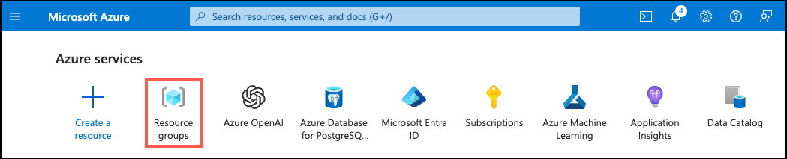

---
lab:
  title: Realización de resumen mediante extracción y abstracción
  module: Summarize data using Azure AI Services and Azure Database for PostgreSQL
---

# Realización de resumen mediante extracción y abstracción

La aplicación de propiedades de alquiler mantenida por Margie's Travel proporciona una manera de que los administradores de propiedades describan los listados de alquiler. Muchas de las descripciones del sistema son largas y proporcionan muchos detalles sobre la propiedad de alquiler, su vecindario, y atracciones locales, tiendas y otras comodidades. Una característica que se ha solicitado a medida que implementas nuevas funcionalidades con tecnología de IA para la aplicación es usar inteligencia artificial generativa para crear resúmenes concisos de estas descripciones, lo que facilita a los usuarios revisar las propiedades rápidamente. En este ejercicio, usarás la extensión `azure_ai` en un servidor flexible de Azure Database for PostgreSQL para realizar resúmenes mediante abstracción y extracción en descripciones de propiedades de alquiler y comparar los resúmenes resultantes.

## Antes de comenzar

Necesitarás una [suscripción a Azure](https://azure.microsoft.com/free) en la que tengas derechos administrativos

### Implementación de recursos en tu suscripción a Azure

Este paso te guiará por el uso de los comandos de la CLI de Azure desde Azure Cloud Shell para crear un grupo de recursos y ejecutar un script de Bicep para implementar los servicios de Azure necesarios para completar este ejercicio en la suscripción a Azure.

1. Abre un explorador web y ve a [Azure Portal](https://portal.azure.com/).

2. Selecciona el icono de **Cloud Shell** en la barra de herramientas de Azure Portal para abrir un nuevo panel de [Cloud Shell](https://learn.microsoft.com/azure/cloud-shell/overview) en la parte inferior de la ventana del explorador.

    

    Si se te solicita, selecciona las opciones necesarias para abrir un shell de *Bash* . Si anteriormente has usado una consola de *PowerShell*, cámbiala a un shell de *Bash*.

3. En el símbolo del sistema de Cloud Shell, escribe lo siguiente para clonar el repositorio de GitHub que contiene recursos del ejercicio:

    ```bash
    git clone https://github.com/MicrosoftLearning/mslearn-postgresql.git
    ```

4. A continuación, ejecutarás tres comandos para definir variables para reducir la escritura redundante al usar comandos de la CLI de Azure para crear recursos de Azure. Las variables representan el nombre que se asignará al grupo de recursos (`RG_NAME`), la región de Azure (`REGION`) en la que se implementarán los recursos y una contraseña generada aleatoriamente para el inicio de sesión de administrador de PostgreSQL (`ADMIN_PASSWORD`).

    En el primer comando, la región asignada a la variable correspondiente es `eastus`, pero también puedes reemplazarla por una ubicación de tu preferencia. Sin embargo, si reemplazas el valor predeterminado, deberás seleccionar otra [región de Azure que admita el resumen abstracto](https://learn.microsoft.com/azure/ai-services/language-service/summarization/region-support) para asegurarte de que puedes completar todas las tareas de los módulos de esta ruta de aprendizaje.

    ```bash
    REGION=eastus
    ```

    El siguiente comando asigna el nombre que se usará para el grupo de recursos que hospedará todos los recursos usados en este ejercicio. El nombre del grupo de recursos asignado a la variable correspondiente es `rg-learn-postgresql-ai-$REGION`, donde `$REGION` es la ubicación especificada anteriormente. Sin embargo, puedes cambiarlo a cualquier otro nombre de grupo de recursos que se adapte a tu preferencia.

    ```bash
    RG_NAME=rg-learn-postgresql-ai-$REGION
    ```

    El comando final genera aleatoriamente una contraseña para el inicio de sesión de administrador de PostgreSQL. **Asegúrate de copiarlo** en un lugar seguro para usarlo más adelante para conectarte al servidor flexible de PostgreSQL.

    ```bash
    a=()
    for i in {a..z} {A..Z} {0..9}; 
        do
        a[$RANDOM]=$i
        done
    ADMIN_PASSWORD=$(IFS=; echo "${a[*]::18}")
    echo "Your randomly generated PostgreSQL admin user's password is:"
    echo $ADMIN_PASSWORD
    ```

5. Si tienes acceso a más de una suscripción a Azure y la suscripción predeterminada no es en la que deseas crear el grupo de recursos y otros recursos para este ejercicio, ejecuta este comando para establecer la suscripción adecuada, reemplazando el token `<subscriptionName|subscriptionId>` por el nombre o el identificador de la suscripción que deseas usar:

    ```azurecli
    az account set --subscription <subscriptionName|subscriptionId>
    ```

6. Ejecuta el siguiente comando de la CLI de Azure para crear tu grupo de recursos:

    ```azurecli
    az group create --name $RG_NAME --location $REGION
    ```

7. Por último, usa la CLI de Azure para ejecutar un script de implementación de Bicep para aprovisionar recursos de Azure en tu grupo de recursos:

    ```azurecli
    az deployment group create --resource-group $RG_NAME --template-file "mslearn-postgresql/Allfiles/Labs/Shared/deploy.bicep" --parameters restore=false adminLogin=pgAdmin adminLoginPassword=$ADMIN_PASSWORD
    ```

    El script de implementación de Bicep aprovisiona los servicios de Azure necesarios para completar este ejercicio en tu grupo de recursos. Los recursos implementados incluyen un servidor flexible de Azure Database for PostgreSQL, Azure OpenAI y un servicio de Lenguaje de Azure AI. El script de Bicep también realiza algunos pasos de configuración, como agregar las extensiones `azure_ai` y `vector` a la _lista de permitidos_ del servidor PostgreSQL (a través del parámetro de servidor azure.extensions), crear una base de datos denominada `rentals` en el servidor y agregar una implementación denominada `embedding` con el modelo `text-embedding-ada-002` al Azure OpenAI Service. Ten en cuenta que todos los módulos de esta ruta de aprendizaje comparten el archivo Bicep, por lo que solo podrás usar algunos de los recursos implementados en algunos ejercicios.

    La implementación suele tarda varios minutos en completarse. Puedes supervisarla desde Cloud Shell o ir a la página **Implementaciones** del grupo de recursos que creaste anteriormente y observar el progreso de la implementación allí.

8. Cierra el panel de Cloud Shell una vez completada la implementación de recursos.

### Solución de errores de implementación

Es posible que encuentres algunos errores al ejecutar el script de implementación de Bicep.

- Si anteriormente ejecutaste el script de implementación de Bicep para esta ruta de aprendizaje y, posteriormente, eliminaste los recursos, puedes recibir un mensaje de error similar al siguiente si intentas volver a ejecutar el script en un plazo de 48 horas después de eliminar los recursos:

    ```bash
    {"code": "InvalidTemplateDeployment", "message": "The template deployment 'deploy' is not valid according to the validation procedure. The tracking id is '4e87a33d-a0ac-4aec-88d8-177b04c1d752'. See inner errors for details."}
    
    Inner Errors:
    {"code": "FlagMustBeSetForRestore", "message": "An existing resource with ID '/subscriptions/{subscriptionId}/resourceGroups/rg-learn-postgresql-ai-eastus/providers/Microsoft.CognitiveServices/accounts/{accountName}' has been soft-deleted. To restore the resource, you must specify 'restore' to be 'true' in the property. If you don't want to restore existing resource, please purge it first."}
    ```

    Si recibes este mensaje, modifica el comando `azure deployment group create` anterior para establecer el parámetro `restore` igual a `true` y vuelve a ejecutarlo.

- Si la región seleccionada está restringida al aprovisionamiento de recursos específicos, deberás establecer la variable `REGION` en otra ubicación y volver a ejecutar los comandos para crear el grupo de recursos y ejecutar el script de implementación de Bicep.

    ```bash
    {"status":"Failed","error":{"code":"DeploymentFailed","target":"/subscriptions/{subscriptionId}/resourceGroups/{resourceGrouName}/providers/Microsoft.Resources/deployments/{deploymentName}","message":"At least one resource deployment operation failed. Please list deployment operations for details. Please see https://aka.ms/arm-deployment-operations for usage details.","details":[{"code":"ResourceDeploymentFailure","target":"/subscriptions/{subscriptionId}/resourceGroups/{resourceGrouName}/providers/Microsoft.DBforPostgreSQL/flexibleServers/{serverName}","message":"The resource write operation failed to complete successfully, because it reached terminal provisioning state 'Failed'.","details":[{"code":"RegionIsOfferRestricted","message":"Subscriptions are restricted from provisioning in this region. Please choose a different region. For exceptions to this rule please open a support request with Issue type of 'Service and subscription limits'. See https://review.learn.microsoft.com/en-us/azure/postgresql/flexible-server/how-to-request-quota-increase for more details."}]}]}}
    ```

- Si el script no puede crear un recurso de IA debido al requisito de aceptar el acuerdo de IA responsable, puedes experimentar el siguiente error; en cuyo caso, usa la interfaz de usuario de Azure Portal para crear un recurso de Servicios de Azure AI y, después, vuelve a ejecutar el script de implementación.

    ```bash
    {"code": "InvalidTemplateDeployment", "message": "The template deployment 'deploy' is not valid according to the validation procedure. The tracking id is 'f8412edb-6386-4192-a22f-43557a51ea5f'. See inner errors for details."}
     
    Inner Errors:
    {"code": "ResourceKindRequireAcceptTerms", "message": "This subscription cannot create TextAnalytics until you agree to Responsible AI terms for this resource. You can agree to Responsible AI terms by creating a resource through the Azure Portal then trying again. For more detail go to https://go.microsoft.com/fwlink/?linkid=2164190"}
    ```


## Conexión a la base de datos mediante psql en Azure Cloud Shell

En esta tarea, te conectas a la base de datos `rentals`de tu servidor flexible Azure Database for PostgreSQL mediante la utilidad de línea de comandos [psql](https://www.postgresql.org/docs/current/app-psql.html) de [Azure Cloud Shell](https://learn.microsoft.com/azure/cloud-shell/overview).

1. En [Azure Portal](https://portal.azure.com/), ve a la instanacia del servidor flexible de Azure Database for PostgreSQL recién creada.

2. En el menú de recursos, en **Configuración**, selecciona **Bases de datos** selecciona **Conectar** para la base de datos `rentals`.

    

3. En el símbolo del sistema "Contraseña para el usuario pgAdmin" de Cloud Shell, escribe la contraseña generada aleatoriamente para el inicio de sesión **pgAdmin**.

    Una vez que hayas iniciado sesión, se muestra la solicitud `psql` de la base de datos `rentals`.

4. Durante el resto de este ejercicio, seguirás trabajando en Cloud Shell, por lo que puede resultar útil expandir el panel dentro de la ventana del explorador seleccionando el botón **Maximizar** en la parte superior derecha del panel.

    

## Rellenado de la base de datos con datos de ejemplo

Antes de explorar la extensión `azure_ai`, agrega un par de tablas a la base de datos `rentals` y rellénalas con datos de ejemplo para que tengas información con la que trabajar mientras revisas la funcionalidad de la extensión.

1. Ejecuta los siguientes comandos para crear las tablas `listings` y `reviews` para almacenar los datos de listados de propiedades de alquiler y de reseñas de clientes:

    ```sql
    DROP TABLE IF EXISTS listings;

    CREATE TABLE listings (
        id int,
        name varchar(100),
        description text,
        property_type varchar(25),
        room_type varchar(30),
        price numeric,
        weekly_price numeric
    );
    ```

    ```sql
    DROP TABLE IF EXISTS reviews;

    CREATE TABLE reviews (
        id int,
        listing_id int, 
        date date,
        comments text
    );
    ```

2. A continuación, usa el comando `COPY` para cargar datos de archivos CSV en cada tabla que creaste anteriormente. Empieza por ejecutar el siguiente comando para rellenar la tabla `listings`:

    ```sql
    \COPY listings FROM 'mslearn-postgresql/Allfiles/Labs/Shared/listings.csv' CSV HEADER
    ```

    La salida del comando debe ser `COPY 50`, que indica que se han escrito 50 filas en la tabla desde el archivo CSV.

3. Por último, ejecuta el comando siguiente para cargar las reseñas de clientes en la tabla `reviews`:

    ```sql
    \COPY reviews FROM 'mslearn-postgresql/Allfiles/Labs/Shared/reviews.csv' CSV HEADER
    ```

    La salida del comando debe ser `COPY 354`, que indica que se han escrito 354 filas en la tabla desde el archivo CSV.

## Instalación y configuración de la extensión `azure_ai`

Antes de usar la extensión `azure_ai`, deberás instalarla en la base de datos y configurarla para conectarse a los recursos de Servicios de Azure AI. La extensión `azure_ai` permite integrar Azure OpenAI y los servicios de Lenguaje de Azure AI en la base de datos. Para habilitar la extensión en la base de datos, sigue estos pasos:

1. Ejecuta el siguiente comando en el símbolo del sistema `psql` para comprobar que las extensiones `azure_ai` y `vector` se agregaron correctamente a la _lista de permitidos_ del servidor mediante el script de implementación de Bicep que ejecutaste al configurar el entorno:

    ```sql
    SHOW azure.extensions;
    ```

    El comando muestra la lista de extensiones en la _lista de permitidos_ del servidor. Si todo se instaló correctamente, la salida deberá incluir `azure_ai` y `vector`, de la siguiente manera:

    ```sql
     azure.extensions 
    ------------------
     azure_ai,vector
    ```

    Para poder instalar y usar una extensión en una base de datos de servidor flexible de Azure Database for PostgreSQL, se debe agregar a la _lista de permitidos_ del servidor, como se describe en [cómo usar extensiones de PostgreSQL](https://learn.microsoft.com/azure/postgresql/flexible-server/concepts-extensions#how-to-use-postgresql-extensions).

2. Ahora estás preparado para instalar la extensión `azure_ai` mediante el comando [CREATE EXTENSION](https://www.postgresql.org/docs/current/sql-createextension.html).

    ```sql
    CREATE EXTENSION IF NOT EXISTS azure_ai;
    ```

    `CREATE EXTENSION` carga una nueva extensión en la base de datos ejecutando su archivo de script. Este script normalmente crea nuevos objetos SQL, como funciones, tipos de datos y esquemas. Se produce un error si ya existe una extensión del mismo nombre. La adición de `IF NOT EXISTS` permite que el comando se ejecute sin producir un error si ya está instalado.

## Creación de la cuenta de Servicios de Azure AI

Las integraciones de Servicios de Azure AI incluidas en el esquema `azure_cognitive` de la extensión `azure_ai` proporcionan un amplio conjunto de características de Lenguaje de IA accesibles directamente desde la base de datos. Las funcionalidades de resumen de texto se habilitan a través del [servicio de Lenguaje de Azure AI](https://learn.microsoft.com/azure/ai-services/language-service/overview).

1. Para realizar llamadas correctamente a tus servicios de Lenguaje de Azure AI mediante la extensión `azure_ai`, debes proporcionar su punto de conexión la clave para la extensión. Con la misma pestaña del explorador donde está abierto Cloud Shell, ve al recurso de Servicio de lenguaje en [Azure Portal](https://portal.azure.com/) y selecciona el elemento **Claves y punto de conexión** en **Administración de recursos** en el menú de navegación izquierdo.

    

    > [!Note]
    >
    > Si recibiste el mensaje `NOTICE: extension "azure_ai" already exists, skipping CREATE EXTENSION` al instalar la extensión `azure_ai` anterior y has configurado previamente la extensión con el punto de conexión y la clave del servicio de Lenguaje, puedes usar la función `azure_ai.get_setting()` para confirmar que la configuración es correcta. Omite el paso 2 si lo es.

2. Copia los valores de punto de conexión y clave de acceso y, después, en los comandos siguientes, reemplaza los tokens `{endpoint}` y `{api-key}` por los valores que copiaste de Azure Portal. Ejecuta los comandos desde el símbolo del sistema `psql` en Cloud Shell para agregar los valores a la tabla `azure_ai.settings`.

    ```sql
    SELECT azure_ai.set_setting('azure_cognitive.endpoint', '{endpoint}');
    ```

    ```sql
    SELECT azure_ai.set_setting('azure_cognitive.subscription_key', '{api-key}');
    ```

## Revisar las funcionalidades de resumen de la extensión

En esta tarea, revisarás las dos funciones de resumen en el esquema `azure_cognitive`.

1. Para el resto de este ejercicio, trabajarás exclusivamente en Cloud Shell, por lo que puede resultar útil expandir el panel dentro de la ventana del explorador mediante la selección del botón **Maximizar** situado en la parte superior derecha del panel de Cloud Shell.

    

2. Cuando trabajas con `psql` en Cloud Shell, puede resultar útil habilitar la pantalla extendida para los resultados de la consulta, ya que mejora la legibilidad de la salida para los comandos posteriores. Ejecuta el siguiente comando para permitir que se aplique automáticamente la pantalla extendida.

    ```sql
    \x auto
    ```

3. Las funciones de resumen de texto de la extensión `azure_ai` se encuentran dentro del esquema `azure_cognitive`. Para el resumen mediante extracción, usa la función `summarize_extractive()`. Usa el [metacomando `\df`](https://www.postgresql.org/docs/current/app-psql.html#APP-PSQL-META-COMMAND-DF-LC) para examinar la función mediante la ejecución de:

    ```sql
    \df azure_cognitive.summarize_extractive
    ```

    La salida del metacomando muestra el esquema, el nombre, el tipo de datos de resultado y los argumentos de la función. Esta información te ayuda a comprender cómo interactuar con la función desde las consultas.

    La salida muestra tres sobrecargas de la función `summarize_extractive()`, lo que te permite revisar sus diferencias. La propiedad `Argument data types` de la salida revela la lista de argumentos que esperan las tres sobrecargas de la función:

    | Argumento | Tipo | Valor predeterminado | Descripción |
    | -------- | ---- | ------- | ----------- |
    | text | `text` o `text[]` || Texto para el que se deben generar resúmenes. |
    | language_text | `text` o `text[]` || Código de idioma (o matriz de códigos de idioma) que representa el idioma del texto que se va a resumir. Revise la [lista de idiomas admitidos](https://learn.microsoft.com/azure/ai-services/language-service/summarization/language-support) para recuperar los códigos de idioma necesarios. |
    | sentence_count | `integer` | 3 | Número de oraciones de resumen que se van a generar. |
    | sort_by | `text` | 'offset' | Criterio de ordenación de las oraciones de resumen generadas. Los valores aceptables son "offset " y "rank", siendo "offset" la posición inicial de cada frase extraída dentro del contenido original y "rank" un indicador generado por la IA de la relevancia de una frase para la idea principal del contenido. |
    | batch_size | `integer` | 25 | Solo para las dos sobrecargas que esperan una entrada de `text[]`. Especifica el número de registros que se van a procesar a la vez. |
    | disable_service_logs | `boolean` | false | Marca que indica si se van a desactivar los registros de servicio. |
    | timeout_ms | `integer` | NULL | Tiempo de espera en milisegundos después del cual se detiene la operación. |
    | throw_on_error | `boolean` | true | Marca que indica si la función debe (en caso de error) producir una excepción, lo que da lugar a una reversión de la transacción de ajuste. |
    | max_attempts | `integer` | 1 | Número de veces que se reintenta la llamada a Servicios de Azure AI en caso de error. |
    | retry_delay_ms | `integer` | 1000 | Cantidad de tiempo, en milisegundos, que se debe esperar antes de intentar volver a llamar al punto de conexión de Servicios de Azure AI. |

4. Repite el paso anterior, pero esta vez ejecuta el [metacomando `\df`](https://www.postgresql.org/docs/current/app-psql.html#APP-PSQL-META-COMMAND-DF-LC) para la función `azure_cognitive.summarize_abstractive()` y revisa la salida.

    Las dos funciones tienen firmas similares, aunque `summarize_abstractive()` no tiene el parámetro `sort_by`, y devuelve una matriz de `text` frente a la matriz de tipos de `azure_cognitive.sentence` compuestas devueltos por la función `summarize_extractive()`. Esta disparidad tiene que ver con la manera en que los dos métodos diferentes generan resúmenes. El resumen mediante extracción identifica las oraciones más críticas dentro del texto que se resume, las clasifica y, a continuación, las devuelve como resumen. Por otro lado, el resumen mediante abstracción usa inteligencia artificial generativa para crear nuevas oraciones originales que resumen los puntos clave del texto.

5. También es imperativo comprender la estructura del tipo de datos que devuelve una función para poder controlar correctamente la salida en las consultas. Para inspeccionar el tipo `azure_cognitive.sentence` devuelto por la función `summarize_extractive()`, ejecuta:

    ```sql
    \dT+ azure_cognitive.sentence
    ```

6. La salida del comando anterior revela que el tipo `sentence` es `tuple`. Para examinar la estructura de ese `tuple` y revisar las columnas contenidas en el tipo de `sentence` compuesta, ejecuta:

    ```sql
    \d+ azure_cognitive.sentence
    ```

    La salida de dicho comando debe ser similar a esta:

    ```sql
                            Composite type "azure_cognitive.sentence"
        Column  |     Type         | Collation | Nullable | Default | Storage  | Description 
    ------------+------------------+-----------+----------+---------+----------+-------------
     text       | text             |           |           |        | extended | 
     rank_score | double precision |           |           |        | plain    |
    ```

    `azure_cognitive.sentence` es un tipo compuesto que contiene el texto de una frase de extracción y una puntuación de clasificación para cada frase, lo que indica lo relevente que es la frase para el tema principal del texto. El resumen de documentos clasifica las oraciones extraídas para que puedas determinar si se devuelven por orden de aparición o según su clasificación.

## Creación de resúmenes para descripciones de propiedades

En esta tarea, usarás las funciones `summarize_extractive()` y `summarize_abstractive()` para crear resúmenes de dos oraciones concisos para las descripciones de propiedades.

1. Ahora que has revisado la función `summarize_extractive()` y `sentiment_analysis_result` la devuelve, pongamos la función en uso. Ejecuta la siguiente consulta básica, que realiza el análisis de sentimiento en una serie de comentarios de la tabla `reviews`:

    ```sql
    SELECT
        id,
        name,
        description,
        azure_cognitive.summarize_extractive(description, 'en', 2) AS extractive_summary
    FROM listings
    WHERE id IN (1, 2);
    ```

    Compara las dos oraciones del campo `extractive_summary` de la salida con el `description` original, teniendo en cuenta que las oraciones no son originales, sino extraídas de `description`. Los valores numéricos enumerados después de cada oración son la puntuación de clasificación asignada por el servicio de lenguaje.

2. A continuación, realiza un resumen mediante abstracción en los registros idénticos:

    ```sql
    SELECT
        id,
        name,
        description,
        azure_cognitive.summarize_abstractive(description, 'en', 2) AS abstractive_summary
    FROM listings
    WHERE id IN (1, 2);
    ```

    Las funcionalidades de resumen mediante abstracción de la extensión proporcionan un resumen único de lenguaje natural que encapsula la intención general del texto original.

    Si recibes un error similar al siguiente, elegiste una región que no admite el resumen mediante abstracción al crear el entorno de Azure:

    ```bash
    ERROR: azure_cognitive.summarize_abstractive: InvalidRequest: Invalid Request.

    InvalidParameterValue: Job task: 'AbstractiveSummarization-task' failed with validation errors: ['Invalid Request.']

    InvalidRequest: Job task: 'AbstractiveSummarization-task' failed with validation error: Document abstractive summarization is not supported in the region Central US. The supported regions are North Europe, East US, West US, UK South, Southeast Asia.
    ```

    Para poder realizar este paso y completar las tareas restantes con el resumen mediante abstracción, debes crear un nuevo servicio de lenguaje de Azure AI en una de las regiones admitidas especificadas en el mensaje de error. Este servicio se puede aprovisionar en el mismo grupo de recursos que usaste para otros recursos de laboratorio. Como alternativa, puedes sustituir el resumen mediante extracción de las tareas restantes, pero no obtendrás la ventaja de poder comparar la salida de las dos técnicas de resumen diferentes.

3. Ejecuta una consulta final para realizar una comparación en paralelo de las dos técnicas de resumen:

    ```sql
    SELECT
        id,
        azure_cognitive.summarize_extractive(description, 'en', 2) AS extractive_summary,
        azure_cognitive.summarize_abstractive(description, 'en', 2) AS abstractive_summary
    FROM listings
    WHERE id IN (1, 2);
    ```

    Al colocar los resúmenes generados en paralelo, es fácil comparar la calidad de los resúmenes generados por cada método. Para la aplicación Margie's Travel, el resumen abstracto es la mejor opción, al proporcionar resúmenes concisos que facilitan información de alta calidad de una manera natural y legible. Aunque proporcionan algunos detalles, los resúmenes mediante extracción son más dispersos y ofrecen menos valor que el contenido original creado por el resumen mediante abstracción.

## Almacenamieto del resumen de descripción en la base de datos

1. Ejecuta la consulta siguiente para modificar la tabla `listings` y agregar una nueva columna `summary`:

    ```sql
    ALTER TABLE listings
    ADD COLUMN summary text;
    ```

2. Para usar inteligencia artificial generativa para crear resúmenes para todas las propiedades existentes de la base de datos, es más eficaz enviar las descripciones en lotes, lo que permite al servicio de lenguaje procesar varios registros simultáneamente.

    ```sql
    WITH batch_cte AS (
        SELECT azure_cognitive.summarize_abstractive(ARRAY(SELECT description FROM listings ORDER BY id), 'en', batch_size => 25) AS summary
    ),
    summary_cte AS (
        SELECT
            ROW_NUMBER() OVER () AS id,
            ARRAY_TO_STRING(summary, ',') AS summary
        FROM batch_cte
    )
    UPDATE listings AS l
    SET summary = s.summary
    FROM summary_cte AS s
    WHERE l.id = s.id;
    ```

    La instrucción de actualización usa dos expresiones de tabla comunes (CTE) para trabajar en los datos antes de actualizar la tabla `listings` con resúmenes. La primera CTE (`batch_cte`) envía todos los valores `description` de la tabla `listings` al servicio de lenguaje para generar resúmenes mediante abstracción. Esto lo hace en lotes de 25 registros cada vez. La segunda CTE (`summary_cte`) usa la posición ordinal de los resúmenes devueltos por la función `summarize_abstractive()` para asignar a cada resumen un `id` correspondiente al registro del que procede la `description` en la tabla `listings`. También usa la función `ARRAY_TO_STRING` para extraer los resúmenes generados del valor devuelto de la matriz de texto (`text[]`) y convertirlo en una cadena básica. Por último, la instrucción `UPDATE` escribe el resumen en la tabla `listings` de la lista asociada.

3. Como último paso, ejecuta una consulta para ver los resúmenes escritos en la tabla `listings`:

    ```sql
    SELECT
        id,
        name,
        description,
        summary
    FROM listings
    LIMIT 5;
    ```

## Generación de un resumen de IA de revisiones para una lista

Para la aplicación Margie's Travel, mostrar un resumen de todas las opiniones de una propiedad ayuda a los usuarios a evaluar rápidamente la esencia general de las opiniones.

1. Ejecuta la consulta siguiente, que combina todas las revisiones de una lista en una sola cadena y, a continuación, genera un resumen mediante abstracción sobre esa cadena:

    ```sql
    SELECT unnest(azure_cognitive.summarize_abstractive(reviews_combined, 'en')) AS review_summary
    FROM (
        -- Combine all reviews for a listing
        SELECT string_agg(comments, ' ') AS reviews_combined
        FROM reviews
        WHERE listing_id = 1
    );
    ```

## Limpiar

Una vez completado este ejercicio, elimina los recursos de Azure que has creado. Se te cobrará por la capacidad configurada y no por cuanto se use la base de datos. Sigue estas instrucciones para eliminar el grupo de recursos y todos los recursos que creaste para este laboratorio.

1. Abre un explorador web y ve a [Azure Portal](https://portal.azure.com/) y, en la página principal, selecciona **Grupos de recursos** en servicios de Azure.

    

2. En el filtro de cualquier campo de búsqueda, escribe el nombre del grupo de recursos que creaste para este laboratorio y, después, selecciona el grupo de recursos de la lista.

3. En la página **Información general** del grupo de recursos, selecciona **Eliminar grupo de recursos**.

    

4. En el cuadro de diálogo de confirmación, escribe el nombre del grupo de recursos que vas a eliminar y, después, selecciona **Eliminar**.
