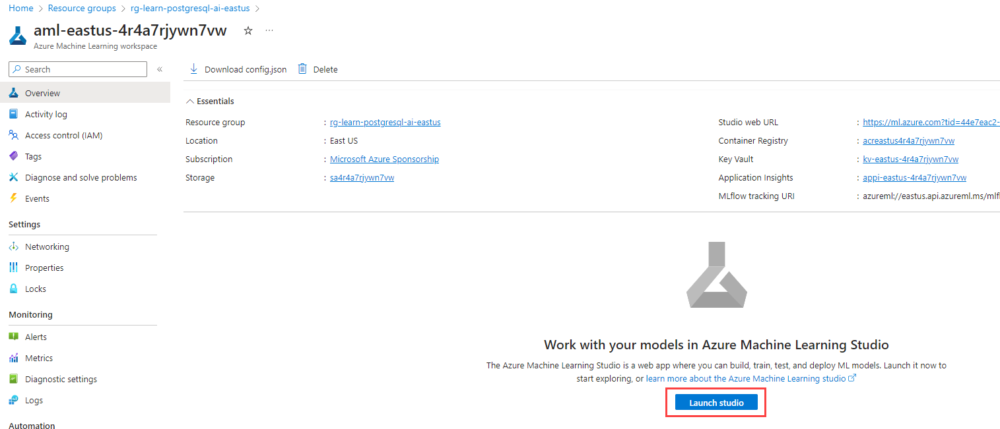

---
lab:
  title: Realización de la inferencia mediante Azure Machine Learning
  module: Use Azure Machine Learning Inferencing with Azure Database for PostgreSQL
---

# Realización de la inferencia mediante Azure Machine Learning

Como desarrollador principal de Margie's Travel (MT), se te ha pedido que ayudes a desarrollar una característica que calcule los precios de alquiler por noche de alquileres a corto plazo. Has recopilado algunos datos históricos en un archivo de texto y te gustaría usarlos para entrenar un modelo de regresión sencillo en Azure Machine Learning. Después, te gustaría usar ese modelo con los datos que tienes hospedados en una base de datos de servidor flexible de Azure Database for PostgreSQL.

En este ejercicio, implementarás un modelo creado mediante la funcionalidad de aprendizaje automático automatizado de Azure Machine Learning. Después, usarás ese modelo implementado para calcular los precios de venta por noche de las propiedades de alquiler a corto plazo.

## Antes de comenzar

Necesitarás una [suscripción a Azure](https://azure.microsoft.com/free) en la que tengas derechos administrativos

### Implementación de recursos en tu suscripción a Azure

Este paso te guiará por el uso de comandos de la CLI de Azure desde Azure Cloud Shell para crear un grupo de recursos y ejecutar un script de Bicep para implementar los servicios de Azure necesarios para completar este ejercicio en tu suscripción a Azure.

1. Abre un explorador web y ve a [Azure Portal](https://portal.azure.com/).

2. Selecciona el icono de **Cloud Shell** en la barra de herramientas de Azure Portal para abrir un nuevo panel de [Cloud Shell](https://learn.microsoft.com/azure/cloud-shell/overview) en la parte inferior de la ventana del explorador.

    

    Si se te solicita, selecciona las opciones necesarias para abrir un shell de *Bash* . Si anteriormente has usado una consola de *PowerShell*, cámbiala a un shell de *Bash*.

3. En el símbolo del sistema de Cloud Shell, escribe lo siguiente para clonar el repositorio de GitHub que contiene recursos del ejercicio:

    ```bash
    git clone https://github.com/MicrosoftLearning/mslearn-postgresql.git
    ```

    Si ya has clonado este repositorio de GitHub en un módulo anterior, seguirá estando disponible para ti y puedes recibir el siguiente mensaje de error:

    ```bash
    fatal: destination path 'mslearn-postgresql' already exists and is not an empty directory.
    ```

    Si recibes este mensaje, puedes continuar con el paso siguiente de forma segura.

4. A continuación, ejecutarás tres comandos para definir variables para reducir la escritura redundante al usar comandos de la CLI de Azure para crear recursos de Azure. Las variables representan el nombre que se asignará al grupo de recursos (`RG_NAME`), la región de Azure (`REGION`) en la que se implementarán los recursos y una contraseña generada aleatoriamente para el inicio de sesión de administrador de PostgreSQL (`ADMIN_PASSWORD`).

    En el primer comando, la región asignada a la variable correspondiente es `eastus`, pero también puedes reemplazarla por una ubicación de tu preferencia. Sin embargo, si reemplazas el valor predeterminado, deberás seleccionar otra [región de Azure que admita el resumen abstracto](https://learn.microsoft.com/azure/ai-services/language-service/summarization/region-support) para asegurarte de que puedes completar todas las tareas de los módulos de esta ruta de aprendizaje.

    ```bash
    REGION=eastus
    ```

    El siguiente comando asigna el nombre que se usará para el grupo de recursos que hospedará todos los recursos usados en este ejercicio. El nombre del grupo de recursos asignado a la variable correspondiente es `rg-learn-postgresql-ai-$REGION`, donde `$REGION` es la ubicación especificada anteriormente. Sin embargo, puedes cambiarlo a cualquier otro nombre de grupo de recursos que se adapte a tu preferencia.

    ```bash
    RG_NAME=rg-learn-postgresql-ai-$REGION
    ```

    El comando final genera aleatoriamente una contraseña para el inicio de sesión de administrador de PostgreSQL. Asegúrate de copiarlo en un lugar seguro para usarlo más adelante para conectarte al servidor flexible de PostgreSQL.

    ```bash
    a=()
    for i in {a..z} {A..Z} {0..9}; 
        do
        a[$RANDOM]=$i
        done
    ADMIN_PASSWORD=$(IFS=; echo "${a[*]::18}")
    echo "Your randomly generated PostgreSQL admin user's password is:"
    echo $ADMIN_PASSWORD
    ```

5. Si tienes acceso a más de una suscripción a Azure y la suscripción predeterminada no es en la que deseas crear el grupo de recursos y otros recursos para este ejercicio, ejecuta este comando para establecer la suscripción adecuada, reemplazando el token `<subscriptionName|subscriptionId>` por el nombre o el identificador de la suscripción que deseas usar:

    ```azurecli
    az account set --subscription <subscriptionName|subscriptionId>
    ```

6. Ejecuta el siguiente comando de la CLI de Azure para crear tu grupo de recursos:

    ```azurecli
    az group create --name $RG_NAME --location $REGION
    ```

7. Por último, usa la CLI de Azure para ejecutar un script de implementación de Bicep para aprovisionar recursos de Azure en tu grupo de recursos:

    ```azurecli
    az deployment group create --resource-group $RG_NAME --template-file "mslearn-postgresql/Allfiles/Labs/Shared/deploy-azure-machine-learning.bicep" --parameters adminLogin=pgAdmin adminLoginPassword=$ADMIN_PASSWORD
    ```

    El script de implementación de Bicep aprovisiona los servicios de Azure necesarios para completar este ejercicio en tu grupo de recursos. Los recursos implementados incluyen un servidor flexible de Azure Database for PostgreSQL y un área de trabajo de Azure Machine Learning. El script de implementación también creará todos los servicios de requisitos previos para crear instancias de un área de trabajo de Azure Machine Learning, incluyendo una cuenta de Azure Blob Storage, una instancia de Azure Key Vault, un repositorio de contenedores de Azure, un espacio de trabajo de Azure Log Analytics y una instancia de información de Aplicación de Azure. El script Bicep también realiza algunos pasos de configuración, como agregar las extensiones `azure_ai` y `vector` a la _lista de permitidos_ del servidor PostgreSQL (a través del parámetro de servidor azure.extensions) y crear una base de datos denominada `rentals` en el servidor. **Ten en cuenta que el archivo bicep difiere de los demás módulos de esta ruta de aprendizaje.**

    La implementación tarda normalmente varios minutos en completarse. Puedes supervisarla desde Cloud Shell o ir a la página **Implementaciones** del grupo de recursos que creaste anteriormente y observar el progreso de la implementación allí.

8. Cierra el panel de Cloud Shell una vez completada la implementación de recursos.

### Solución de errores de implementación

Es posible que encuentres algunos errores al ejecutar el script de implementación de Bicep.

- Si anteriormente ejecutaste el script de implementación de Bicep para esta ruta de aprendizaje y, posteriormente, eliminaste los recursos, puedes recibir un mensaje de error similar al siguiente si intentas volver a ejecutar el script en un plazo de 48 horas después de eliminar los recursos:

    ```bash
    {"code": "InvalidTemplateDeployment", "message": "The template deployment 'deploy' is not valid according to the validation procedure. The tracking id is '4e87a33d-a0ac-4aec-88d8-177b04c1d752'. See inner errors for details."}
    
    Inner Errors:
    {"code": "FlagMustBeSetForRestore", "message": "An existing resource with ID '/subscriptions/{subscriptionId}/resourceGroups/rg-learn-postgresql-ai-eastus/providers/Microsoft.CognitiveServices/accounts/{accountName}' has been soft-deleted. To restore the resource, you must specify 'restore' to be 'true' in the property. If you don't want to restore existing resource, please purge it first."}
    ```

    Si recibes este mensaje, modifica el comando `azure deployment group create` anterior para establecer el parámetro `restore` igual a `true` y vuelve a ejecutarlo.

- Si la región seleccionada está restringida al aprovisionamiento de recursos específicos, deberás establecer la variable `REGION` en otra ubicación y volver a ejecutar los comandos para crear el grupo de recursos y ejecutar el script de implementación de Bicep.

    ```bash
    {"status":"Failed","error":{"code":"DeploymentFailed","target":"/subscriptions/{subscriptionId}/resourceGroups/{resourceGrouName}/providers/Microsoft.Resources/deployments/{deploymentName}","message":"At least one resource deployment operation failed. Please list deployment operations for details. Please see https://aka.ms/arm-deployment-operations for usage details.","details":[{"code":"ResourceDeploymentFailure","target":"/subscriptions/{subscriptionId}/resourceGroups/{resourceGrouName}/providers/Microsoft.DBforPostgreSQL/flexibleServers/{serverName}","message":"The resource write operation failed to complete successfully, because it reached terminal provisioning state 'Failed'.","details":[{"code":"RegionIsOfferRestricted","message":"Subscriptions are restricted from provisioning in this region. Please choose a different region. For exceptions to this rule please open a support request with Issue type of 'Service and subscription limits'. See https://review.learn.microsoft.com/en-us/azure/postgresql/flexible-server/how-to-request-quota-increase for more details."}]}]}}
    ```

- Si el script no puede crear un recurso de IA debido al requisito de aceptar el contrato de IA responsable, puedes experimentar el siguiente error; en cuyo caso, usa la interfaz de usuario de Azure Portal para crear un recurso de Servicios de Azure AI y, a continuación, vuelve a ejecutar el script de implementación.

    ```bash
    {"code": "InvalidTemplateDeployment", "message": "The template deployment 'deploy' is not valid according to the validation procedure. The tracking id is 'f8412edb-6386-4192-a22f-43557a51ea5f'. See inner errors for details."}
     
    Inner Errors:
    {"code": "ResourceKindRequireAcceptTerms", "message": "This subscription cannot create TextAnalytics until you agree to Responsible AI terms for this resource. You can agree to Responsible AI terms by creating a resource through the Azure Portal then trying again. For more detail go to https://go.microsoft.com/fwlink/?linkid=2164190"}
    ```

## Implementación de un modelo de Azure Machine Learning

El primer paso es la implementación de un modelo en Azure Machine Learning. El repositorio contiene un ejemplo de un modelo entrenado con un conjunto de datos de ofertas inmobiliarias, que usarás en la integración de PostgreSQL.

1. Descarga el archivo `mlflow-model.zip` desde [el repositorio mslearn-postgresql](../../Allfiles/Labs/Shared/mlflow-model.zip). Extrae los archivos de este en una carpeta denominada **mlflow-model**.

2. En [Azure Portal](https://portal.azure.com/), ve al área de trabajo de Azure Machine Learning que acabas de crear.

3. Selecciona el botón **Iniciar estudio** para abrir Estudio de Azure Machine Learning.

    

4. Selecciona la opción **Modelos** del menú **Activos**. Después, selecciona la opción de menú **+ Registrar** y elige **De archivos locales**.

    

5. En el menú **Cargar modelo**, establece el tipo de modelo en **MLflow**. Después, elige **Examinar**, ve a tu carpeta **mlflow-model** y carga los recursos. Después, selecciona el botón **Siguiente** para continuar.

    

6. Asigna al modelo el nombre **RentalListings** y después selecciona el botón **Siguiente**.

    

7. Selecciona el botón **Registrar** para completar el registro del modelo. Esta acción te devolverá a la página **Modelos**. Selecciona el modelo recién creado.

> [!Note]
>
> Si no ves ningún modelo, selecciona el botón de opción de menú **Actualizar** para volver a cargar la página. Después, deberías ver el modelo **RentalListings**.

8. Selecciona la opción del botón **Implementar** y crea un nuevo **punto de conexión en tiempo real**.

    

9. En el menú desplegable de implementación, establece la **Máquina virtual** en algo parecido a **Standard_DS2_v2** y el **Recuento de instancias** en 1. Seleccione el botón **Implementar**. La implementación puede tardar varios minutos en completarse, ya que el proceso de implementación incluye el aprovisionamiento de una máquina virtual e implementación del modelo como contenedor de Docker.

    

10. Después de que el punto de conexión se implemente, ve a la pestaña **Consumir** y copia el punto de conexión REST y la clave principal para que puedas usarlos en la siguiente sección.

    

11. Para probar que tu punto de conexión se está ejecutando correctamente, puedes usar la pestaña **Prueba** de tu punto de conexión. Después, pega el siguiente bloque y reemplaza cualquier entrada que exista actualmente. Selecciona el botón **Prueba**, y deberías ver una salida JSON que contenga una matriz con un único valor decimal que indique el número de dólares estadounidenses que deberías esperar que esta propiedad determinada obtenga por una sola noche de alquiler.

    ```json
    {
        "input_data": {
            "columns": [
                "host_is_superhost",
                "host_has_profile_pic",
                "host_identity_verified",
                "neighbourhood_group_cleansed",
                "zipcode",
                "property_type",
                "room_type",
                "accommodates",
                "bathrooms",
                "bedrooms",
                "beds"
            ],
            "index": [0],
            "data": [["0", "0", "0", "Central Area", "98122", "House", "Entire home/apt", 4, 1.5, 3, 3]]
        }
    }
    ```

    

## Conéctate a tu base de datos mediante psql en Azure Cloud Shell

En esta tarea, te conectarás a la base de datos `rentals` en el servidor flexible de Azure Database for PostgreSQL mediante la [utilidad de línea de comandos psql](https://www.postgresql.org/docs/current/app-psql.html) de [Azure Cloud Shell](https://learn.microsoft.com/azure/cloud-shell/overview).

1. En [Azure Portal](https://portal.azure.com/), ve al servidor flexible de Azure Database for PostgreSQL recién creado.

2. En el menú de recursos, en **Configuración**, selecciona **Bases de datos** selecciona **Conectar** para la base de datos `rentals`.

    

3. En el símbolo del sistema "Contraseña para el usuario pgAdmin" de Cloud Shell, escribe la contraseña generada aleatoriamente para el inicio de sesión **pgAdmin**.

    Una vez que hayas iniciado sesión, se muestra la solicitud `psql` de la base de datos `rentals`.

4. Durante el resto de este ejercicio, seguirás trabajando en Cloud Shell, por lo que puede resultar útil expandir el panel dentro de la ventana del explorador seleccionando el botón **Maximizar** en la parte superior derecha del panel.

    

## Instalación y configuración de la extensión `azure_ai`

Antes de usar la extensión `azure_ai`, deberás instalarla en la base de datos y configurarla para conectarse a los recursos de Servicios de Azure AI. La extensión `azure_ai` permite integrar Azure OpenAI y los servicios de Lenguaje de Azure AI en la base de datos. Para habilitar la extensión en la base de datos, sigue estos pasos:

1. Ejecuta el siguiente comando en el símbolo del sistema `psql` para comprobar que las extensiones `azure_ai` y `vector` se agregaron correctamente a la _lista de permitidos_ del servidor mediante el script de implementación de Bicep que ejecutaste al configurar el entorno:

    ```sql
    SHOW azure.extensions;
    ```

    El comando muestra la lista de extensiones en la _lista de permitidos_ del servidor. Si todo se ha instalado correctamente, tu salida debe incluir `azure_ai` y `vector`, de la siguiente manera:

    ```sql
     azure.extensions 
    ------------------
     azure_ai,vector
    ```

    Antes de que se pueda instalar y usar una extensión en el servidor flexible de Azure Database for PostgreSQL, se debe agregar a la _lista de permitidos_ del servidor, como se describe en [cómo usar extensiones de PostgreSQL](https://learn.microsoft.com/azure/postgresql/flexible-server/concepts-extensions#how-to-use-postgresql-extensions).

2. Ahora, estás listo para instalar la extensión `azure_ai` mediante el comando [CREATE EXTENSION](https://www.postgresql.org/docs/current/sql-createextension.html).

    ```sql
    CREATE EXTENSION IF NOT EXISTS azure_ai;
    ```

    `CREATE EXTENSION` carga una nueva extensión en la base de datos ejecutando su archivo de script. Este script normalmente crea nuevos objetos SQL, como funciones, tipos de datos y esquemas. Se produce un error si ya existe una extensión del mismo nombre. Agregar `IF NOT EXISTS` permite que el comando se ejecute sin producir un error si ya está instalado.

3. A continuación, debes usar la función `azure_ai.set_setting()` para configurar la conexión a tu punto de conexión al implementar Azure Machine Learning. Configura los ajustes de `azure_ml` para que apunten a tu punto de conexión al implementar y su clave. El valor de `azure_ml.scoring_endpoint` será la dirección URL de REST del punto de conexión. El valor de `azure_ml.endpoint_key` será el valor de Key 1 o Key 2.

    ```sql
    SELECT azure_ai.set_setting('azure_ml.scoring_endpoint','https://<YOUR_ENDPOINT>.<YOUR_REGION>.inference.ml.azure.com/score');
    ```

    ```sql
    SELECT azure_ai.set_setting('azure_ml.endpoint_key', '<YOUR_KEY>');
    ```

## Crear una tabla que contenga listados de precios

Necesitarás una tabla para almacenar listados de alquiler a corto plazo a los que desees poner precio.

1. Ejecuta el siguiente comando en la base de datos `rentals` para crear una nueva tabla `listings_to_price`.

    ```sql
    CREATE TABLE listings_to_price (
        id INT GENERATED BY DEFAULT AS IDENTITY PRIMARY KEY,
        host_is_superhost INT NOT NULL,
        host_has_profile_pic INT NOT NULL,
        host_identity_verified INT NOT NULL,
        neighbourhood_group_cleansed VARCHAR(75) NOT NULL,
        zipcode VARCHAR(5) NOT NULL,
        property_type VARCHAR(30) NOT NULL,
        room_type VARCHAR(30) NOT NULL,
        accommodates INT NOT NULL,
        bathrooms DECIMAL(3,1) NOT NULL,
        bedrooms INT NOT NULL,
        beds INT NOT NULL
    );
    ```

2. Después, ejecuta el siguiente comando en la base de datos `rentals` para insertar nuevos datos de lista de alquiler.

    ```sql
    INSERT INTO listings_to_price(host_is_superhost, host_has_profile_pic, host_identity_verified,
        neighbourhood_group_cleansed, zipcode, property_type, room_type,
        accommodates, bathrooms, bedrooms, beds)
    VALUES
        (1, 1, 1, 'Queen Anne', '98119', 'House', 'Private room', 2, 1.0, 1, 1),
        (0, 1, 1, 'University District', '98105', 'Apartment', 'Entire home/apt', 4, 1.5, 2, 2),
        (0, 0, 0, 'Central Area', '98122', 'House', 'Entire home/apt', 4, 1.5, 3, 3),
        (0, 0, 0, 'Downtown', '98101', 'House', 'Entire home/apt', 4, 1.5, 3, 3),
        (0, 0, 0, 'Capitol Hill', '98122', 'House', 'Entire home/apt', 4, 1.5, 3, 3);
    ```

    Este comando inserta cinco filas de datos de lista nuevos.

## Creación de una función para traducir datos de lista

Para rellenar la tabla de traducción de idioma, crearás un procedimiento almacenado para cargar datos en lotes.

1. Ejecuta el siguiente comando en el símbolo del sistema `psql` para crear una nueva función denominada `price_listing`.

    ```sql
    CREATE OR REPLACE FUNCTION price_listing (
        IN host_is_superhost INT, IN host_has_profile_pic INT, IN host_identity_verified INT,
        IN neighbourhood_group_cleansed VARCHAR(75), IN zipcode VARCHAR(5), IN property_type VARCHAR(30),
        IN room_type VARCHAR(30), IN accommodates INT, IN bathrooms DECIMAL(3,1), IN bedrooms INT, IN beds INT)
    RETURNS DECIMAL(6,2)
    AS $$
        SELECT CAST(jsonb_array_elements(inference.inference) AS DECIMAL(6,2)) AS expected_price
        FROM azure_ml.inference(('
        {
            "input_data": {
                "columns": [
                    "host_is_superhost",
                    "host_has_profile_pic",
                    "host_identity_verified",
                    "neighbourhood_group_cleansed",
                    "zipcode",
                    "property_type",
                    "room_type",
                    "accommodates",
                    "bathrooms",
                    "bedrooms",
                    "beds"
                ],
                "index": [0],
                "data": [["' || host_is_superhost || '", "' || host_has_profile_pic || '", "' || host_identity_verified || '", "' ||
                neighbourhood_group_cleansed || '", "' || zipcode || '", "' || property_type || '", "' || room_type || '", ' ||
                accommodates || ', ' || bathrooms || ', ' || bedrooms || ', ' || beds || ']]
            }
        }')::jsonb, deployment_name=>'rentallistings-1');
    $$ LANGUAGE sql;
    ```

> [!Note]
>
> De forma predeterminada, el nombre de implementación es una combinación del nombre del modelo (**rentallistings**) y el número de versión (**1**). Si implementas una nueva versión del modelo y usas el nombre de implementación predeterminado, el nuevo nombre de implementación sería **rentallistings-2**.

2. Ejecuta la función mediante el siguiente comando SQL:

    ```sql
    SELECT * FROM price_listing(0, 0, 0, 'Central Area', '98122', 'House', 'Entire home/apt', 4, 1.5, 3, 3);
    ```

    Esta consulta devuelve una estimación del precio de alquiler por noche en formato decimal.

3. Llama a la función para cada fila de la tabla `listings_to_price` mediante el siguiente comando SQL:

    ```sql
    SELECT l2p.*, expected_price
    FROM listings_to_price l2p
        CROSS JOIN LATERAL price_listing(l2p.host_is_superhost, l2p.host_has_profile_pic, l2p.host_identity_verified,
            l2p.neighbourhood_group_cleansed, l2p.zipcode, l2p.property_type, l2p.room_type,
            l2p.accommodates, l2p.bathrooms, l2p.bedrooms, l2p.beds) expected_price;
    ```

    Esta consulta devuelve cinco filas, una para cada fila de `listings_to_price`. Incluirá todas las columnas de la tabla `listings_to_price` y el resultado de la función `price_listing()` como `expected_price`.

## Limpiar

Una vez completado este ejercicio, elimina los recursos de Azure que has creado. Se te cobrará por la capacidad configurada y no por cuanto se use la base de datos. Sigue estas instrucciones para eliminar el grupo de recursos y todos los recursos que creaste para este laboratorio.

1. Abre un explorador web y ve a [Azure Portal](https://portal.azure.com/) y, en la página principal, selecciona **Grupos de recursos** en servicios de Azure.

    

2. En el cuadro de búsqueda Filtrar por cualquier campo, escribe el nombre del grupo de recursos que has creado para este laboratorio y después selecciona el grupo de recursos de la lista.

3. En la página **Información general** del grupo de recursos, selecciona **Eliminar grupo de recursos**.

    

4. En el cuadro de diálogo de confirmación, escribe el nombre del grupo de recursos que vas a eliminar y, después, selecciona **Eliminar**.
